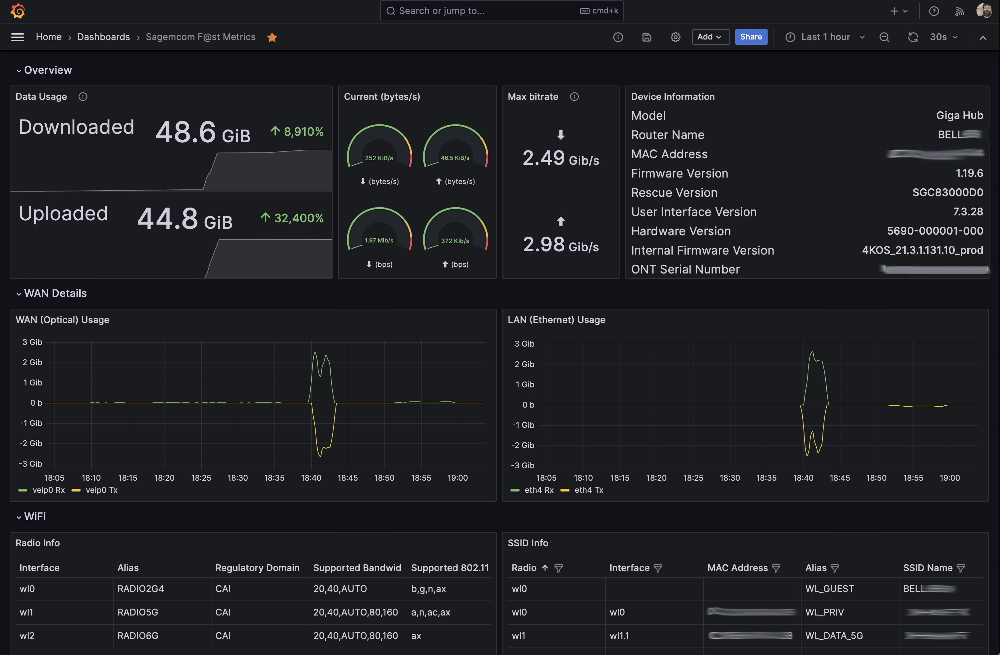

# Sagemcom F@st Prometheus Exporter

A Prometheus exporter for the Sagemcom F@st series of fibre hub/routers. It gathers metrics on demand using the HTTP API.

Much of this was ported from https://github.com/iMicknl/python-sagemcom-api, so thanks to @iMicknl for doing the hard work of figuring out the API!

## Compatibility

| Model Number | Firmwares known to work | Notes                              |
|--------------|-------------------------|------------------------------------|
| 5690         | 1.19.6, 2.13            | Marketed by Bell Canada as GigaHub |

If you have a model not listed here but able to run the exporter, please file an issue or issue a PR to update this list!

If you'd like to get an unsupported model working, please file an issue and I'll try to help you out.

## Installation

You can build a binary for your system with `go install github.com/hairyhenderson/sagemcom_fast_exporter@latest`, or you can use a [pre-built Docker image](https://hub.docker.com/r/hairyhenderson/sagemcom_fast_exporter):

```console
$ docker run hairyhenderson/sagemcom_fast_exporter
```

There are two variants: `:latest` and `:alpine` - no difference except the latter is based on Alpine and contains a shell. The former is a `FROM scratch` image, containing only the binary.

The image is built for multiple platforms and architectures:

- `linux/amd64` (x86_64)
- `linux/arm64` (64-bit ARM/aarch64)
- `linux/arm/v6` (32-bit ARM v6, like Raspberry Pi Zero)
- `linux/arm/v7` (32-bit ARM v7, like Raspbarry Pi 2B)
- `windows/amd64` (Windows, based on Windows Nano Server)

See https://hub.docker.com/r/hairyhenderson/sagemcom_fast_exporter.

## Usage

The exporter needs to be given at least the address of the device (with `-host`), and the credentials (`-username` and `-password`). The default username is `admin`, so you likely only need to provide the password (which is the device's serial number by default).

By default, the exporter listens only on localhost, on port 9780. For metrics to be accessible from a Prometheus server running on a different host from the exporter, set `-addr` to listen to `0.0.0.0:<port>` (or a specific IP address).

```console
$ sagemcom_fast_exporter -addr 0.0.0.0:9780 -host 192.168.2.1 -password ABC123456789
```

Now you can visit http://localhost:9780/scrape to have the exporter scrape metrics from the device. Note that it will take a few seconds for the device to respond (usually around 5-10s).

To configure Prometheus to scrape from this exporter, use a [scrape_config](https://prometheus.io/docs/prometheus/latest/configuration/configuration/#scrape_config) like this one:

```yaml
  - job_name: 'gigahub'
    metrics_path: /scrape
    static_configs:
      - targets:
        - 'localhost:9780'
```

## Grafana Dashboard

There's a Grafana dashboard published to [Grafana.com](https://grafana.com/grafana/dashboards/20374) and also available [in this repo](./dashboard.json) which looks like this:



The easiest way to get set up with Grafana is to use [Grafana Cloud](https://grafana.com/products/cloud/), which has an excellent free tier.

To use it, you'll need to set up a Prometheus data source in Grafana, and then import the dashboard.

## License

[The MIT License](http://opensource.org/licenses/MIT)

Copyright (c) 2023-2025 Dave Henderson
